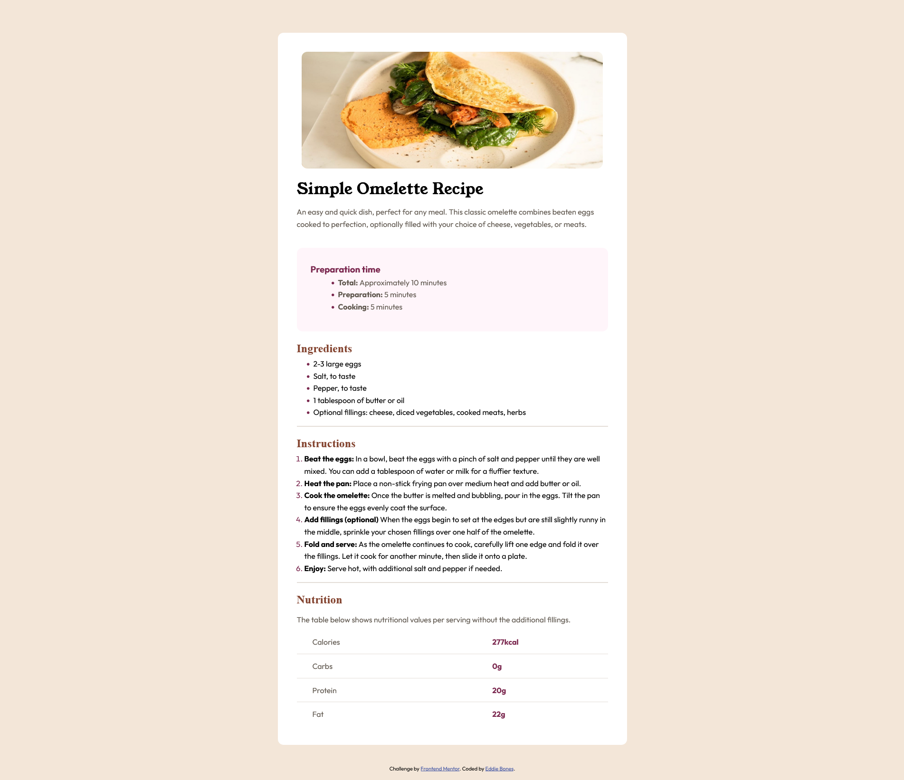
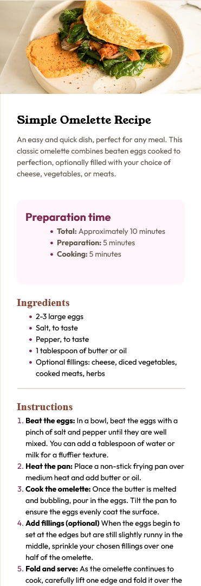

# Frontend Mentor - Recipe page solution

This is a solution to the [Recipe page challenge on Frontend Mentor](https://www.frontendmentor.io/challenges/recipe-page-KiTsR8QQKm). Frontend Mentor challenges help you improve your coding skills by building realistic projects. 

## Table of contents

- [Overview](#overview)
  - [The challenge](#the-challenge)
  - [Screenshot](#screenshot)
  - [Links](#links)
- [My process](#my-process)
  - [Built with](#built-with)
  - [What I learned](#what-i-learned)
  - [Challenges](#challenges)
  - [Useful resources](#useful-resources)
- [Author](#author)

## Overview

### Screenshot

#### Desktop Design


#### Mobile Design



- Solution URL: [Add solution URL here](https://your-solution-url.com)
- Live Site URL: [Add live site URL here](https://your-live-site-url.com)

## My process

### Built with

- Semantic HTML5 markup
- CSS custom properties
- Flexbox
- CSS Grid
- SASS 

### What I learned

While I was working on this project, I learned how to use SCSS and it really speed up the process in my stylesheet. 

### Challenges

One thing that I found challenging while working on this project is the nutritional facts chart. I had a difficult time formatting the table like that of the original design. I thought by add horizontal lines, it would achieve what I was looking for... but it didn't. Until, I found out about the ```:not``` and ```:last-of-type``` psuedo classes from **mdn web docs_**

### Useful resources

- [mdn web docs_](https://developer.mozilla.org/en-US/) - This online resources explains both the ```:not``` and ```:last-of-type``` psuedo classes. 

## Author

- Frontend Mentor - [@EddieBones1](https://www.frontendmentor.io/profile/EddieBones1)
- Linkedin -[Linkedin](https://www.linkedin.com/in/eddiewhite01/)
